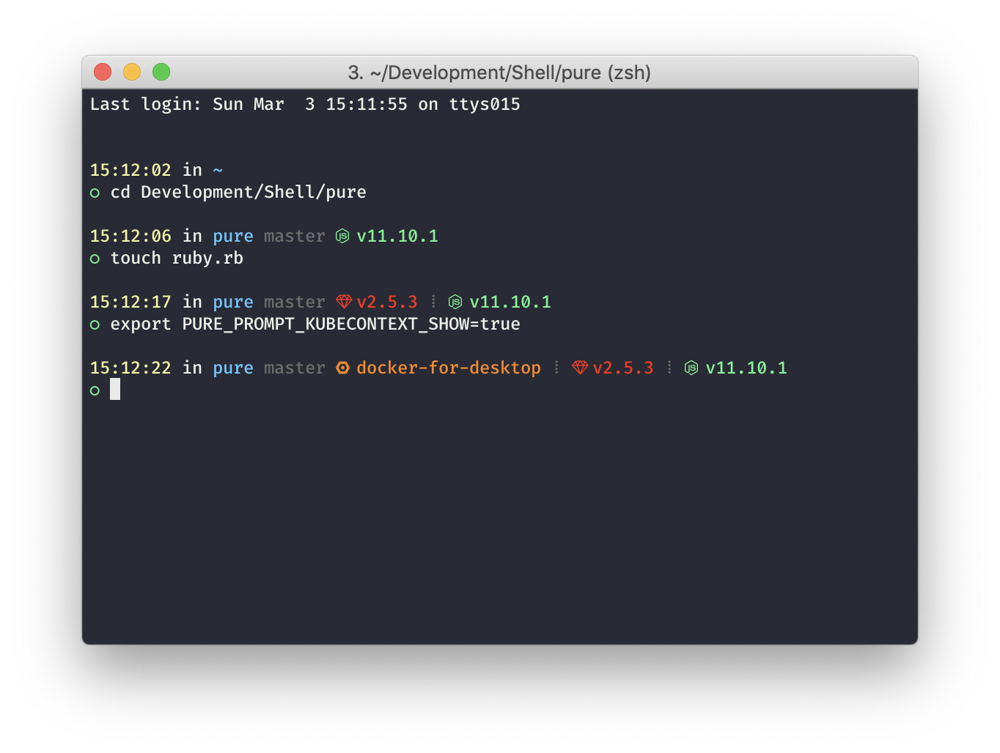

# Pure

> Pretty, minimal and fast ZSH prompt

This is a fork of [sindresorhus/pure](https://github.com/sindresorhus/pure), as used in our [dotfiles](https://github.com/zenjoy/dotfiles).
It takes many of the good ideas from the Spaceship prompt and brings it to the speed and elegance of the Pure prompt.

- Show the current time
- Battery percentage when running low
- Truncating the directory tree for long paths or in Git repos
- Git Stash status (based on the work in https://github.com/sindresorhus/pure/pull/462)
- Ruby version
- Node.js version
- Go version
- Terraform workspace
- Kubernetes context
- Docker Compose container status

All checks are done _asynchronously_.



In the screenshot Pure is running in [iTerm2]([https://hyper.is](https://www.iterm2.com/)) with the [iterm2-snazzy](https://github.com/sindresorhus/iterm2-snazzy) colors and FiraCode Nerd Font from https://nerdfonts.com/.

### Other features

- Comes with the perfect prompt character.
  Author went through the whole Unicode range to find it.
- Shows `git` branch and whether it's dirty (with a `*`).
- Indicates when you have unpushed/unpulled `git` commits with up/down arrows.
- Prompt character turns red if the last command didn't exit with `0`.
- Command execution time will be displayed if it exceeds the set threshold.
- Username and host only displayed when in an SSH session.
- Shows the current path in the title and the [current folder & command](screenshot-title-cmd.png) when a process is running.
- Support VI-mode indication by reverse prompt symbol (Zsh 5.3+).
- Makes an excellent starting point for your own custom prompt.

## Install

Can be installed with `npm` or manually. Requires Git 2.0.0+ and ZSH 5.2+. Older versions of ZSH are known to work, but they are **not** recommended.

### npm

```console
$ npm install --global pure-prompt
```

That's it. Skip to [Getting started](#getting-started).

### Manually

1. Either…
  - Clone this repo
  - add it as a submodule, or
  - just download [`pure.zsh`](pure.zsh) and [`async.zsh`](async.zsh)

2. Symlink `pure.zsh` to somewhere in [`$fpath`](https://www.refining-linux.org/archives/46-ZSH-Gem-12-Autoloading-functions.html) with the name `prompt_pure_setup`.

3. Symlink `async.zsh` in `$fpath` with the name `async`.

#### Example

```console
$ ln -s "$PWD/pure.zsh" /usr/local/share/zsh/site-functions/prompt_pure_setup
$ ln -s "$PWD/async.zsh" /usr/local/share/zsh/site-functions/async
```
*Run `echo $fpath` to see possible locations.*

For a user-specific installation (which would not require escalated privileges), simply add a directory to `$fpath` for that user:

```sh
# .zshenv or .zshrc
fpath=( "$HOME/.zfunctions" $fpath )
```

Then install the theme there:

```console
$ ln -s "$PWD/pure.zsh" "$HOME/.zfunctions/prompt_pure_setup"
$ ln -s "$PWD/async.zsh" "$HOME/.zfunctions/async"
```


## Getting started

Initialize the prompt system (if not so already) and choose `pure`:

```sh
# .zshrc
autoload -U promptinit; promptinit
prompt pure
```


## Options

For possible color codes, see https://jonasjacek.github.io/colors/. The current symbols work with all fonts from https://nerdfonts.com/ (you can lookup the symbol with https://nerdfonts.com/#cheat-sheet).

| Option                                       | Description                                                                                    | Default value  |
| :------------------------------------------- | :--------------------------------------------------------------------------------------------- | :------------- |
| **`PURE_CMD_MAX_EXEC_TIME`**                 | The max execution time of a process before its run time is shown when it exits.                | `5` seconds    |
| **`PURE_GIT_PULL=0`**                        | Prevents Pure from checking whether the current Git remote has been updated.                   |                |
| **`PURE_GIT_UNTRACKED_DIRTY=0`**             | Do not include untracked files in dirtiness check. Mostly useful on large repos (like WebKit). |                |
| **`PURE_GIT_DELAY_DIRTY_CHECK`**             | Time in seconds to delay git dirty checking when `git status` takes > 5 seconds.               | `1800` seconds |
| **`PURE_PROMPT_SYMBOL`**                     | Defines the prompt symbol.                                                                     | `❯`            |
| **`PURE_PROMPT_VICMD_SYMBOL`**               | Defines the prompt symbol used when the `vicmd` keymap is active (VI-mode).                    | `❮`            |
| **`PURE_GIT_DOWN_ARROW`**                    | Defines the git down arrow symbol.                                                             | `⇣`            |
| **`PURE_GIT_UP_ARROW`**                      | Defines the git up arrow symbol.                                                               | `⇡`            |
| **`PURE_PROMPT_BATTERY_SHOW`**               | Show battery section or not (true, false, always or charged)                                   | `true`         |
| **`PURE_PROMPT_BATTERY_WARNING_THRESHOLD`**  | Battery level below which battery section will be shown in yellow                              | `20`           |
| **`PURE_PROMPT_BATTERY_THRESHOLD`**          | Battery level below which battery section will be shown in red                                 | `10`           |
| **`PURE_PROMPT_BATTERY_SYMBOL_CHARGING`**    | Character to be shown if battery is charging                                                   | `⇡`            |
| **`PURE_PROMPT_BATTERY_SYMBOL_DISCHARGING`** | Character to be shown if battery is discharging                                                | `⇣`            |
| **`PURE_PROMPT_BATTERY_SYMBOL_FULL`**        | Character to be shown if battery is full                                                       | `•`            |
| **`PURE_PROMPT_KUBECONTEXT_SHOW`**           | Show the active kubectl context or not                                                         | `true`         |
| **`PURE_PROMPT_KUBECONTEXT_NAMESPACE_SHOW`** | Should namespace be also displayed                                                             | `true`         |
| **`PURE_PROMPT_KUBECONTEXT_SYMBOL`**         | Character to be shown before Kubectl context                                                   | `\ue7b2 `      |
| **`PURE_PROMPT_KUBECONTEXT_COLOR`**          | Color of Kubectl context section                                                               | `208`          |
| **`PURE_PROMPT_TERRAFORM_SHOW`**             | Show the active Terraform workspace in directories that contain .terraform/environment file.   | `true`         |
| **`PURE_PROMPT_TERRAFORM_SYMBOL`**           | Character to be shown before Terraform workspace                                               | `\uf9fd`       |
| **`PURE_PROMPT_TERRAFORM_COLOR`**            | Color of Terraform workspace section                                                           | `105`          |
| **`PURE_PROMPT_RUBY_SHOW`**                  | Show Ruby version in directories that contain Gemfile, Rakefile, or any .rb file.              | `true`         |
| **`PURE_PROMPT_RUBY_SYMBOL`**                | Character to be shown before Ruby version                                                      | `\ue21e `      |
| **`PURE_PROMPT_RUBY_COLOR`**                 | Color of Ruby version section                                                                  | `196`          |
| **`PURE_PROMPT_NODE_SHOW`**                  | Show Node.js version in directories with package.json, node_modules folder, or any .js file.   | `true`         |
| **`PURE_PROMPT_NODE_SYMBOL`**                | Character to be shown before Node.js version                                                   | `\uf898 `      |
| **`PURE_PROMPT_NODE_COLOR`**                 | Color of Node.js version section                                                               | `green`        |
| **`PURE_PROMPT_GOLANG_SHOW`**                | Show Go version in $GOPATH or in directories with go.mod, Godeps, glide.yaml, or any .go file. | `true`         |
| **`PURE_PROMPT_GOLANG_SYMBOL`**              | Character to be shown before Golang version                                                    | `\ue627 `      |
| **`PURE_PROMPT_GOLANG_COLOR`**               | Color of Golang version section                                                                | `cyan`         |
| **`PURE_PROMPT_DOCKERCOMPOSE_SHOW`**         | Show the state of Docker containers in directories containing a docker-compose.yml file.       | `true`         |
| **`PURE_PROMPT_DOCKERCOMPOSE_SYMBOL`**       | Character to be shown before Terraform workspace                                               | `\uf308  `     |
| **`PURE_PROMPT_DOCKERCOMPOSE_COLOR`**        | Color of Docker Compose section                                                                | `32`           |

## Example

```sh
# .zshrc

autoload -U promptinit; promptinit

# optionally define some options
PURE_CMD_MAX_EXEC_TIME=10

prompt pure
```

## Integration

### [oh-my-zsh](https://github.com/robbyrussell/oh-my-zsh)

1. Set `ZSH_THEME=""` in your `.zshrc` to disable oh-my-zsh themes.
2. Follow the Pure [Install](#install) instructions.
3. Do not enable the following (incompatible) plugins: `vi-mode`, `virtualenv`.

**NOTE:** `oh-my-zsh` overrides the prompt so Pure must be activated *after* `source $ZSH/oh-my-zsh.sh`.

### [prezto](https://github.com/sorin-ionescu/prezto)

Pure is bundled with Prezto. No need to install it.

Add `prompt pure` to your `~/.zpreztorc`.

### [zim](https://github.com/Eriner/zim)

Pure is bundled with Zim. No need to install it.

Set `zprompt_theme='pure'` in `~/.zimrc`.

### [antigen](https://github.com/zsh-users/antigen)

Update your `.zshrc` file with the following two lines (order matters). Do not use the `antigen theme` function.

```sh
antigen bundle mafredri/zsh-async
antigen bundle zenjoy/pure
```

### [antibody](https://github.com/getantibody/antibody)

Update your `.zshrc` file with the following two lines (order matters):

```sh
antibody bundle mafredri/zsh-async
antibody bundle zenjoy/pure
```

### [zplug](https://github.com/zplug/zplug)

Update your `.zshrc` file with the following two lines:

```sh
zplug mafredri/zsh-async, from:github
zplug zenjoy/pure, use:pure.zsh, from:github, as:theme
```

### [zplugin](https://github.com/zdharma/zplugin)

Update your `.zshrc` file with the following two lines (order matters):

```sh
zplugin ice pick"async.zsh" src"pure.zsh"
zplugin light zenjoy/pure
```

## License

MIT © [Zenjoy](https://www.zenjoy.be)
